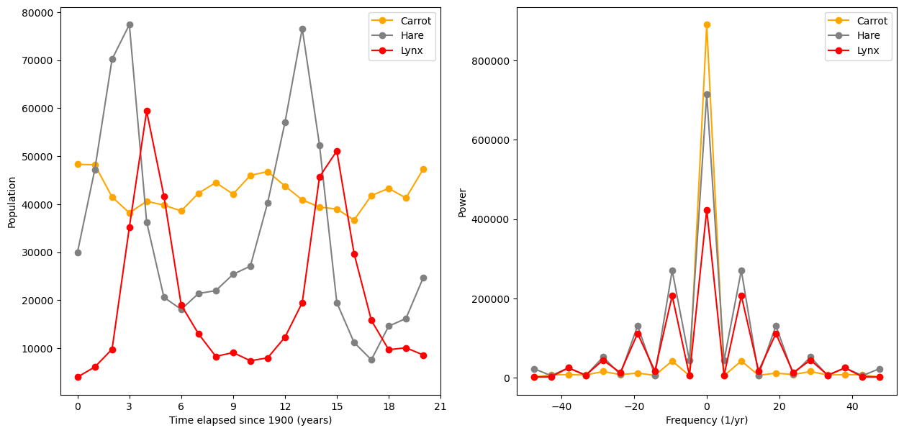
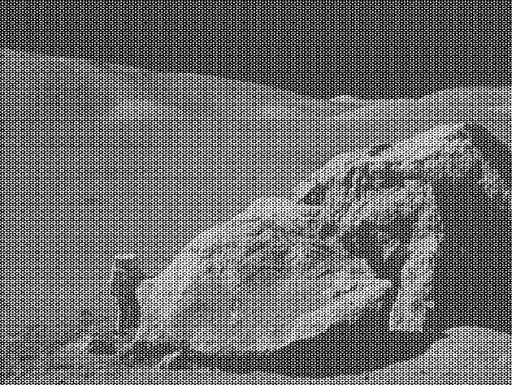
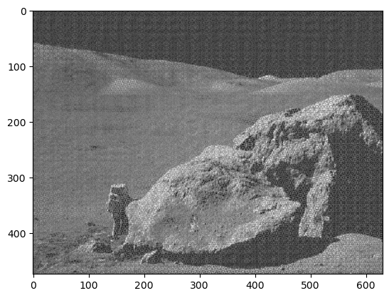
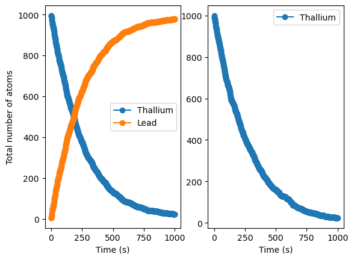

# Python Fundamentals for Physics of Data 

Exercise notebooks for the **Laboratory of Computational Physics, module A** course (Master's degree in Physics of Data at UniPD, year 2025). Mostly Python basics in the direction of scientific data analysis.

## Notebooks

| File | Topics |
|------|--------|
| `00ex_introduction.ipynb` | Warm‑up: loops, conditionals, tuples, functions, list comprehensions, normalization |
| `01ex_Fundamentals.ipynb` | Modules, pure functions, decorators, recursion, higher‑order functions, classes |
| `02ex_NumberRepresentation.ipynb` | Base conversion, IEEE 754, under/overflow, machine precision, numerical differentiation |
| `bash_ex1.sh` and `bash_ex2.sh` (bash scripts)| Bash scripting: file manipulation, text processing, `wget`, `grep`, `awk`, `sed` |
| `04ex_Numpy.ipynb` | NumPy array ops, broadcasting, boolean masking, plotting, prime sieve, random walks |
| `05ex_OSEMN.ipynb` | File I/O: text, CSV, binary, JSON; basic Pandas |
| `06ex_Pandas.ipynb` | Pandas DataFrame operations, groupby, time‑to‑digital converter data |
| `07ex_Visualization.ipynb` | Matplotlib KDE, scatter plots, profile plots Seaborn regression |
| `08ex_LinearAlgebra.ipynb` | PCA, covariance vs. SVD, dimensionality reduction, noisy nD data |
| `09ex_Algorithms.ipynb` | Quantile estimation via spline interpolation, curve fitting with `curve_fit`, 2D minimization of six‑hump camelback (`minimize`/`basinhopping`), FFT periodicity of lynx–hare populations, 2D FFT image denoising |
| `10ex_MonteCarlo.ipynb` | Radioactive decay chain simulation (binomial time-stepping vs. inverse transform sampling), Rutherford scattering and impact-parameter threshold, Monte Carlo integration (hit/miss vs. mean-value method), error estimation, high-dimensional sphere volume, importance sampling |

## Example Plots
Some example plots that were generated in the notebooks:

**FFT power analysis on real-life dataset** (`09ex_Algorithms.ipynb`)  

Plotting a population of lynxes, hares, and carrots versus time, and their (Fast) Fourier Transform (FFT) frequency versus power (respectively). (Incidentally, clearly [a periodic solution of the Lotka-Volterra differential equations](https://github.com/LiberoP/lotka_volterra_sim)).

**Image denoising via FFT** (`09ex_Algorithms.ipynb`)  

Using Fast Fourier Transform (FFT) to remove periodic noise from an image: before (above) and after (below).

**MC-simulated radioactive decay** (`10ex_MonteCarlo.ipynb`)  

Simulating "by hand" (i.e., only using `NumPy`) a radiocative Th->Pb decay (two different simulation strategies on the left and on the right) via a simple Monte Carlo approach.

## Usage

Run the notebooks with Jupyter. (Requirements are only some rather standard libraries). Some notebooks need external data files included in the `data` folder.
Some tutorials and explanations can be found in `lectures`.

## Declaration of AI use

My personal goal for this course was to learn Python from scratch, only relying on provided examples and online documentation. Therefore the use of Generative AI was kept to a minimum, mostly for debugging purposes.